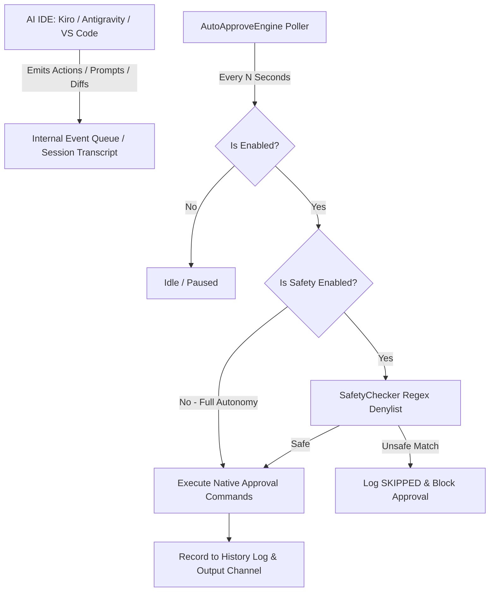

<div align="center">


# ⚡ AI IDE Auto-Approve Extension

**The universal, ultra-fast, 100% native auto-approval extension for AI-powered IDEs (Kiro IDE, Google Antigravity IDE, VS Code).**

[](LICENSE)
[](https://github.com/MaheshTechnicals/AI-IDE-Auto-Approve-Extension/releases/latest)
[](https://github.com/MaheshTechnicals/AI-IDE-Auto-Approve-Extension)
[](package.json)
[](test/)
[](https://github.com/MaheshTechnicals/AI-IDE-Auto-Approve-Extension/releases/latest)

</div>

---

> **⚠️ Note:** This extension is **NOT available** on the VS Code Marketplace. It is distributed as a `.vsix` file via [GitHub Releases](https://github.com/MaheshTechnicals/AI-IDE-Auto-Approve-Extension/releases/latest). Follow the installation instructions below to install it manually.

---

## 🌟 Overview

**AI IDE Auto-Approve Extension** is a universal autonomous auto-approval extension engineered for **Google Antigravity IDE**, **Kiro IDE**, and any **VS Code-based AI agent IDE**.

During active AI coding sessions, AI agents regularly prompt you to confirm terminal executions, file modifications, tool calls, diff reviews, and API fetches. **AI IDE Auto-Approve** runs a lightweight native background engine that automatically approves these requests in real-time, eliminating interruptions while maintaining complete user control.

In **Google Antigravity IDE**, it directly synchronizes with the native Unified State Sync SQLite database (`state.vscdb`), injecting over **180+ explicit developer tool grants** across 12 major categories so commands run autonomously with zero permission popups.

### 🌍 Cross-Platform Support

Fully tested and verified on **Windows**, **Linux**, and **macOS** with intelligent path resolution:
- Linux: `~/.config/`, `~/.gemini/`, `~/.kiro/`, `$XDG_CONFIG_HOME`
- macOS: `~/Library/Application Support/`, `~/.gemini/`, `~/.kiro/`
- Windows: `%APPDATA%`, `%LOCALAPPDATA%`

---

## 🚀 Key Features

- ⚡ **Native Antigravity USS Database Synchronization**: Directly injects bit-exact Protobuf permissions into Antigravity IDE's internal `state.vscdb` (`permission_grants_global`), solving the limitation where the native language server ignores `command(*)` wildcards.
- 🧰 **180+ Pre-Approved Developer Commands**: Out-of-the-box autonomous execution for:
  - **Shells**: `bash`, `zsh`, `sh`, `dash`, `fish`, `ksh`
  - **Runtimes & Package Managers**: `node`, `npm`, `npx`, `pnpm`, `yarn`, `bun`, `deno`, `python3`, `pip`, `uv`, `conda`, `poetry`
  - **Core Utilities**: `git`, `curl`, `wget`, `sed`, `awk`, `jq`, `base64`, `tar`, `chmod`, `rm`, `mv`, `cp`, `grep`, `find`, `cat`, `ls`, `head`, `tail`
  - **Compilers & Build Tools**: `gcc`, `g++`, `clang`, `make`, `cmake`, `ninja`, `rustc`, `cargo`, `go`, `javac`, `gradle`, `dotnet`
  - **Containers & Cloud**: `docker`, `docker-compose`, `kubectl`, `helm`, `terraform`, `aws`, `gcloud`, `az`, `gh`
  - **Databases**: `sqlite3`, `psql`, `mysql`, `redis-cli`, `mongosh`
  - **Mobile**: `adb`, `emulator`, `fastboot`, `scrcpy`
  - **IDE & AI Tools**: `code`, `antigravity`, `agy`, `kiro`
- ⚡ **Zero Screen Automation / No OCR**: Works 100% through native Extension Host APIs, session transcript inspection, and internal execution handlers. Zero mouse simulation, zero pixel scraping. Works reliably over VNC, SSH remote, WSL, and headless setups.
- 🔓 **Full Autonomy / Unrestricted Mode**: Auto-approves all agent tool calls, terminal commands, diff hunks, and popups immediately without restrictions.
- 🛡️ **Optional Security Denylist**: When safety mode is enabled, pending actions are evaluated against a configurable regex denylist covering destructive operations (`rm -rf`, `sudo`, `mkfs`, `format`, `curl | sh`, `drop table`, reverse shells).
- 🔍 **Discovery-First Architecture**: Built-in discovery command that dynamically enumerates registered Kiro and Antigravity commands and extension exports.
- 🖥️ **Status Bar Controller**: Visual indicator on the bottom status bar with one-click toggling and live stats counter in the tooltip.
- 📜 **Audit History**: In-memory activity log with interactive QuickPick review to inspect recent actions with timestamps and payloads.

---

## 📦 Installation

> **This extension is installed via `.vsix` file from GitHub Releases — NOT from the VS Code Marketplace.**

### Step 1: Download the VSIX

Go to **[GitHub Releases](https://github.com/MaheshTechnicals/AI-IDE-Auto-Approve-Extension/releases/latest)** and download the latest `ai-ide-auto-approve-x.x.x.vsix` file.

Or download directly via CLI:
```bash
# Download latest release VSIX
gh release download --repo MaheshTechnicals/AI-IDE-Auto-Approve-Extension --pattern '*.vsix'
```

### Step 2: Install in Your IDE

#### Google Antigravity IDE
```bash
antigravity --install-extension ai-ide-auto-approve-1.1.0.vsix --force
```
Or open **Extensions sidebar** → Click `...` → **"Install from VSIX..."** → Select the downloaded `.vsix` file.

#### Kiro IDE
```bash
kiro --install-extension ai-ide-auto-approve-1.1.0.vsix --force
```
Or open **Extensions** (`Ctrl+Shift+X`) → Click `...` → **"Install from VSIX..."** → Select the downloaded `.vsix` file.

#### VS Code (with AI Agent Extensions)
```bash
code --install-extension ai-ide-auto-approve-1.1.0.vsix --force
```
Or open **Extensions** (`Ctrl+Shift+X`) → Click `...` → **"Install from VSIX..."** → Select the downloaded `.vsix` file.

### Step 3: Build from Source (Alternative)
```bash
# Clone the repository
git clone https://github.com/MaheshTechnicals/AI-IDE-Auto-Approve-Extension.git
cd AI-IDE-Auto-Approve-Extension

# Install dependencies and build
npm install
npm run build

# Package VSIX
npx @vscode/vsce package --no-dependencies

# Install into your IDE
antigravity --install-extension ai-ide-auto-approve-1.1.0.vsix --force
# OR
kiro --install-extension ai-ide-auto-approve-1.1.0.vsix --force
# OR
code --install-extension ai-ide-auto-approve-1.1.0.vsix --force
```

---

## 🎯 How to Use

### 1. Activate / Pause
Click the status bar item in the bottom right corner:
- `⚡ Auto-Approve: ALL` — Currently active. Every popup/command is approved automatically in Full Autonomy mode.
- `▶ Auto-Approve: OFF` — Currently paused. Click to enable.

### 2. Toggle Safety Mode
Open the Command Palette (`Ctrl+Shift+P`) and run:
```text
AI IDE Auto-Approve: Toggle Safety Checks On/Off
```

### 3. View Activity Logs
- Run `AI IDE Auto-Approve: Show Recent Activity` to open an interactive modal listing recent approvals.
- Run `AI IDE Auto-Approve: Show Logs` to open the dedicated Output channel.

---

## ⚙️ Configuration Reference

Accessible via `Settings > Extensions > AI IDE Auto-Approve`:

| Setting | Type | Default | Description |
|---|---|---|---|
| `aiIdeAutoApprove.enabled` | `boolean` | `true` | Master switch for the auto-approval polling loop. |
| `aiIdeAutoApprove.safetyEnabled` | `boolean` | `false` | When `false` (Full Autonomy), all commands and popups are approved without restriction. When `true`, runs denylist checks. |
| `aiIdeAutoApprove.pollIntervalSeconds` | `number` | `2` | Polling frequency in seconds (minimum: 1s). |
| `aiIdeAutoApprove.enableKiro` | `boolean` | `true` | Enable native auto-approval monitoring for Kiro IDE. |
| `aiIdeAutoApprove.enableAntigravity` | `boolean` | `true` | Enable native auto-approval monitoring for Google Antigravity IDE. |
| `aiIdeAutoApprove.antigravityApproveCommands` | `string[]` | *(Array)* | Commands triggered to approve actions in Google Antigravity IDE. |
| `aiIdeAutoApprove.approveCommandId` | `string` | `kiroAgent.execution.runOrAcceptAll` | Native Kiro command executed to confirm pending actions. |
| `aiIdeAutoApprove.getPendingCommandId` | `string` | `""` | Optional command ID to fetch pending items. Leave empty for automatic session monitoring. |
| `aiIdeAutoApprove.bannedKeywords` | `string[]` | *(See safety list)* | Regex patterns that block execution when safety check is enabled. |
| `aiIdeAutoApprove.maxHistoryEntries` | `number` | `200` | Number of recent activity records kept in memory. |

*(Note: Legacy `kiroAutoApprove.*` configuration keys are also supported for full backward compatibility).*

---

## ⌨️ Command Palette Reference

| Command ID | Title | Description |
|---|---|---|
| `aiIdeAutoApprove.toggle` | `AI IDE Auto-Approve: Toggle On/Off` | Toggles the approval loop ON or OFF. |
| `aiIdeAutoApprove.toggleSafety` | `AI IDE Auto-Approve: Toggle Safety Checks On/Off` | Switches between Full Autonomy and Safety Denylist modes. |
| `aiIdeAutoApprove.showHistory` | `AI IDE Auto-Approve: Show Recent Activity` | Opens a QuickPick viewer to inspect past decisions. |
| `aiIdeAutoApprove.clearHistory` | `AI IDE Auto-Approve: Clear History` | Clears the in-memory decision history log. |
| `aiIdeAutoApprove.addBannedKeyword` | `AI IDE Auto-Approve: Add Banned Keyword` | Prompts for a regex pattern and appends it to configuration. |
| `aiIdeAutoApprove.dumpAvailableCommands`| `AI IDE Auto-Approve: Discover Editor Commands (Debug)` | Discovers all editor commands containing `kiro`, `antigravity`, or agent keywords. |
| `aiIdeAutoApprove.openOutput` | `AI IDE Auto-Approve: Show Logs` | Displays the output log stream in the Output panel. |

---

## 🏗️ Architecture



---

## 🛡️ Safety Denylist (Default Patterns)

When safety mode is enabled (`aiIdeAutoApprove.safetyEnabled: true`), these dangerous patterns are blocked:

| Category | Blocked Patterns |
|---|---|
| **Destructive File Ops** | `rm -rf`, `rm -r -f`, `rm --recursive --force` |
| **Privilege Escalation** | `sudo` |
| **Disk Formatting** | `mkfs`, `dd if=`, `format C:` (Windows) |
| **System Control** | `shutdown`, `reboot`, `passwd` |
| **Remote Code Exec** | `curl \| sh`, `curl \| bash`, `wget \| sh` |
| **Unsafe Permissions** | `chmod 777`, `chmod a+rwx` |
| **Git Force Push** | `git push --force` |
| **Database Destruction** | `DROP TABLE`, `DROP DATABASE`, `TRUNCATE TABLE` |
| **Raw Disk Access** | `/dev/sd[a-z]` |
| **Windows Registry** | `regedit`, `reg delete` |
| **PowerShell Danger** | `Remove-Item -Recurse -Force`, `Set-ExecutionPolicy Bypass` |
| **Reverse Shells** | `nc -e`, `/dev/tcp/` |
| **Windows File Deletion** | `del /s`, `del /q`, `del /f` |

All patterns are case-insensitive regex. You can add custom patterns via `AI IDE Auto-Approve: Add Banned Keyword` in the Command Palette.

---

## 🧪 Development & Testing

```bash
# Clone the repository
git clone https://github.com/MaheshTechnicals/AI-IDE-Auto-Approve-Extension.git
cd AI-IDE-Auto-Approve-Extension

# Install dependencies
npm install

# Run unit tests (80 test cases)
npm test

# Run linter / typecheck
npm run lint

# Build production bundle via esbuild
npm run build

# Watch mode for extension development
npm run watch

# Package VSIX for distribution
npx @vscode/vsce package --no-dependencies
```

Press **`F5`** inside VS Code / Kiro IDE / Antigravity IDE to launch an Extension Development Host with live breakpoints and debugging.

---

## 📋 Release History

| Version | Date | Highlights |
|---|---|---|
| **v1.1.0** | 2026-09-18 | Cross-platform hardening: macOS Application Support paths, Linux XDG_CONFIG_HOME, 5-candidate path search |
| **v1.0.0** | 2026-09-18 | Major milestone: 180+ command grants, native Protobuf USS injection, 80 tests |
| **v0.4.0** | 2026-09-18 | Rebrand to "AI IDE Auto-Approve Extension", dual namespace support |
| **v0.3.0** | 2026-09-18 | Google Antigravity IDE integration, dual-engine architecture |
| **v0.2.3** | 2026-09-18 | Real-time decision counters, refined safety patterns |
| **v0.2.0** | 2026-09-18 | Full Autonomy mode, safety toggle |
| **v0.1.0** | 2026-09-18 | Initial release |

See full changelog in [CHANGELOG.md](CHANGELOG.md).

---

## 🤝 Contributing

1. Fork the repository
2. Create your feature branch (`git checkout -b feature/awesome-feature`)
3. Commit your changes (`git commit -m 'Add awesome feature'`)
4. Push to the branch (`git push origin feature/awesome-feature`)
5. Open a Pull Request

---

## 📄 License

This project is licensed under the [MIT License](LICENSE).

---

## 💖 Support This Project

If this extension saves you time and makes your AI coding sessions smoother, please consider supporting the project!

### ⭐ Star This Repository

Give this repo a **star** on GitHub — it helps others discover this project and motivates continued development!

<a href="https://github.com/MaheshTechnicals/AI-IDE-Auto-Approve-Extension">
  
</a>

### ☕ Buy Me a Coffee

<a href="https://www.buymeacoffee.com/MaheshTechnicals" target="_blank">
  
</a>

### 💰 Donate via PayPal

<a href="https://www.paypal.com/paypalme/Varma161" target="_blank">
  
</a>

**PayPal:** [paypal.me/Varma161](https://www.paypal.com/paypalme/Varma161)

> Every contribution — whether it's a ⭐ star, a ☕ coffee, or a 💰 donation — keeps this project alive and growing. Thank you! 🙏

---

<div align="center">

**Made with ❤️ by [MaheshTechnicals](https://github.com/MaheshTechnicals)**

[⬇️ Download Latest Release](https://github.com/MaheshTechnicals/AI-IDE-Auto-Approve-Extension/releases/latest) · [🐛 Report Bug](https://github.com/MaheshTechnicals/AI-IDE-Auto-Approve-Extension/issues) · [✨ Request Feature](https://github.com/MaheshTechnicals/AI-IDE-Auto-Approve-Extension/issues) · [💖 Support / Donate](https://www.paypal.com/paypalme/Varma161)

</div>

