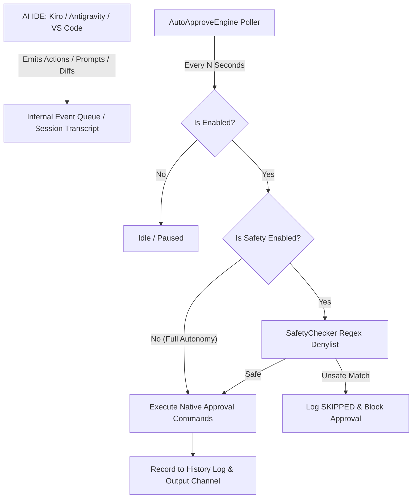

<div align="center">


# ⚡ AI IDE Auto-Approve Extension

**The universal, ultra-fast, 100% native auto-approval extension for AI-powered IDEs (Kiro IDE, Google Antigravity IDE, VS Code).**

[](LICENSE)
[](package.json)
[](https://github.com/MaheshTechnicals/AI-IDE-Auto-Approve-Extension)
[](package.json)
[](test/antigravityState.test.ts)

</div>

---

## 🌟 Overview

**AI IDE Auto-Approve Extension** is a universal autonomous auto-approval extension engineered for **Google Antigravity IDE**, **Kiro IDE**, and **VS Code AI agents**.

During active AI coding sessions, AI agents regularly prompt you to confirm terminal executions, file modifications, tool calls, diff reviews, and API fetches. **AI IDE Auto-Approve** runs a lightweight native background engine that automatically approves these requests in real-time, eliminating interruptions while maintaining complete user control.

In **Google Antigravity IDE**, it directly synchronizes with the native Unified State Sync SQLite database (`state.vscdb`), injecting over **180+ explicit developer tool grants** across 12 major categories so commands run autonomously with zero permission popups.

---

## 🚀 Key Features

- ⚡ **Native Antigravity USS Database Synchronization**: Directly injects bit-exact Protobuf permissions into Antigravity IDE's internal `state.vscdb` (`permission_grants_global`), solving the limitation where the native language server ignores `command(*)` wildcards.
- 🧰 **180+ Pre-Approved Developer Commands**: Out-of-the-box autonomous execution for Shells (`bash`, `zsh`, `sh`), Runtimes & Package Managers (`node`, `npm`, `pnpm`, `yarn`, `bun`, `python3`, `pip`, `uv`), Core Utilities (`git`, `curl`, `wget`, `sed`, `awk`, `jq`, `base64`, `tar`, `chmod`, `rm`, `mv`), Compilers (`gcc`, `make`, `rustc`, `cargo`, `go`), Containers (`docker`, `kubectl`), Databases (`sqlite3`, `psql`), and Android tools (`adb`, `scrcpy`).
- ⚡ **Zero Screen Automation / No OCR**: Works 100% through native Extension Host APIs, session transcript inspection, and internal execution handlers (`antigravity.command.accept`, `antigravity.terminalCommand.run`, `antigravity.prioritized.agentAcceptAllInFile`, `kiroAgent.execution.runOrAcceptAll`). Zero mouse simulation, zero pixel scraping, zero OCR delays. Works reliably over VNC, SSH remote, WSL, and headless setups.
- 🔓 **Full Autonomy / Unrestricted Mode**: Auto-approves all agent tool calls, terminal commands, diff hunks, and popups immediately without restrictions.
- 🛡️ **Optional Security Denylist**: When safety mode is enabled, pending actions are evaluated against a configurable regex denylist covering destructive operations (`rm -rf`, `sudo`, `mkfs`, `format`, `curl | sh`, `drop table`, reverse shells).
- 🔍 **Discovery-First Architecture**: Built-in discovery command (`aiIdeAutoApprove.dumpAvailableCommands`) that dynamically enumerates registered Kiro and Antigravity commands and extension exports.
- 🖥️ **Status Bar Controller**: Visual indicator on the bottom status bar with one-click toggling (`$(zap) Auto-Approve: ALL` / `$(play) Auto-Approve: OFF`) and live stats counter in the tooltip.
- 📜 **Audit History**: In-memory activity log with interactive QuickPick review to inspect recent actions with timestamps and payloads.

---

## 📦 Quick Installation

### Option 1: Install Pre-built `.vsix` in Kiro IDE
1. Download [ai-ide-auto-approve-1.1.0.vsix](file:///root/projects/AutoRun/ai-ide-auto-approve-1.1.0.vsix).
2. In **Kiro IDE**, open Extensions (`Ctrl+Shift+X`).
3. Click `...` > **"Install from VSIX..."** and select `ai-ide-auto-approve-1.1.0.vsix`.

### Option 2: Install in Google Antigravity IDE
Run via CLI:
```bash
antigravity --install-extension ai-ide-auto-approve-1.1.0.vsix --force
```
Or install directly via Extensions sidebar in Antigravity IDE.

### Option 3: Build & Install via CLI
```bash
# Clone the repository
git clone https://github.com/MaheshTechnicals/AI-IDE-Auto-Approve-Extension.git
cd AI-IDE-Auto-Approve-Extension

# Install dependencies and build bundle
npm install
npm run build

# Package VSIX
npx @vscode/vsce package --no-dependencies

# Install directly into Kiro or Antigravity
kiro --install-extension ai-ide-auto-approve-1.1.0.vsix --force
antigravity --install-extension ai-ide-auto-approve-1.1.0.vsix --force
```

---

## 🎯 How to Use

1. **Activate / Pause**:
   Click the status bar item in the bottom right corner:
   - `⚡ Auto-Approve: ALL` — Currently active. Every popup/command is approved automatically in Full Autonomy mode.
   - `▶ Auto-Approve: OFF` — Currently paused.

2. **Toggle Safety Mode**:
   Open the Command Palette (`Ctrl+Shift+P`) and run:
   ```text
   AI IDE Auto-Approve: Toggle Safety Checks On/Off
   ```

3. **View Activity Logs**:
   - Run `AI IDE Auto-Approve: Show Recent Activity` to open an interactive modal listing recent approvals.
   - Run `AI IDE Auto-Approve: Show Logs` to open the dedicated Output channel.

---

## ⚙️ Configuration Reference

Accessible via `Settings > Extensions > AI IDE Auto-Approve`:

| Setting | Type | Default | Description |
|---|---|---|---|
| `aiIdeAutoApprove.enabled` | `boolean` | `true` | Master switch for the auto-approval polling loop. |
| `aiIdeAutoApprove.safetyEnabled` | `boolean` | `false` | When `false` (Full Autonomy), all commands and popups are approved without restriction. When `true`, runs denylist checks. |
| `aiIdeAutoApprove.pollIntervalSeconds` | `number` | `2` | Polling frequency in seconds (minimum: 1s). |
| `aiIdeAutoApprove.enableKiro` | `boolean` | `true` | Enable native auto-approval monitoring for Kiro IDE. |
| `aiIdeAutoApprove.enableAntigravity` | `boolean` | `true` | Enable native auto-approval monitoring for Google Antigravity IDE. |
| `aiIdeAutoApprove.antigravityApproveCommands` | `string[]` | *(Array)* | Commands triggered to approve actions in Google Antigravity IDE. |
| `aiIdeAutoApprove.approveCommandId` | `string` | `kiroAgent.execution.runOrAcceptAll` | Native Kiro command executed to confirm pending actions. |
| `aiIdeAutoApprove.getPendingCommandId` | `string` | `""` | Optional command ID to fetch pending items. Leave empty for automatic session monitoring. |
| `aiIdeAutoApprove.bannedKeywords` | `string[]` | *(See safety list)* | Regex patterns that block execution when safety check is enabled. |
| `aiIdeAutoApprove.maxHistoryEntries` | `number` | `200` | Number of recent activity records kept in memory. |

*(Note: Legacy `kiroAutoApprove.*` configuration keys are also supported for full backward compatibility).*

---

## ⌨️ Command Palette Reference

| Command ID | Title | Description |
|---|---|---|
| `aiIdeAutoApprove.toggle` | `AI IDE Auto-Approve: Toggle On/Off` | Toggles the approval loop ON or OFF. |
| `aiIdeAutoApprove.toggleSafety` | `AI IDE Auto-Approve: Toggle Safety Checks On/Off` | Switches between Full Autonomy and Safety Denylist modes. |
| `aiIdeAutoApprove.showHistory` | `AI IDE Auto-Approve: Show Recent Activity` | Opens a QuickPick viewer to inspect past decisions. |
| `aiIdeAutoApprove.clearHistory` | `AI IDE Auto-Approve: Clear History` | Clears the in-memory decision history log. |
| `aiIdeAutoApprove.addBannedKeyword` | `AI IDE Auto-Approve: Add Banned Keyword` | Prompts for a regex pattern and appends it to configuration. |
| `aiIdeAutoApprove.dumpAvailableCommands`| `AI IDE Auto-Approve: Discover Editor Commands (Debug)` | Discovers all editor commands containing `kiro`, `antigravity`, or agent keywords. |
| `aiIdeAutoApprove.openOutput` | `AI IDE Auto-Approve: Show Logs` | Displays the output log stream in the Output panel. |

---

## 🏗️ Architecture



---

## 🧪 Development & Testing

```bash
# Run unit tests (80 test cases covering all regex rules, Protobuf serialization, extraction payloads, and multi-IDE dispatch)
npm test

# Run linter / typecheck
npm run lint

# Build production bundle via esbuild
npm run build

# Watch mode for extension development
npm run watch
```

Press **`F5`** inside VS Code / Kiro IDE / Antigravity IDE to launch an Extension Development Host with live breakpoints and debugging.

---

## 📄 License

This project is licensed under the [MIT License](LICENSE).
