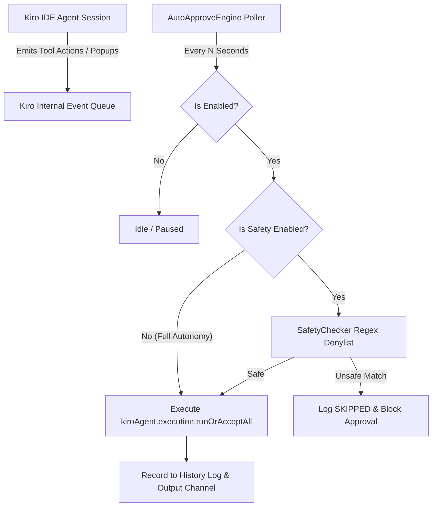

<div align="center">


# ⚡ Kiro & Google Antigravity Auto-Approve

**The ultra-fast, 100% native auto-approval extension for Kiro IDE & Google Antigravity AI Agent workflows.**

[](LICENSE)
[](package.json)
[](https://github.com/MaheshTechnicals/kiro-Auto-Approve-Extension)
[](package.json)
[](test/safety.test.ts)

</div>

---

## 🌟 Overview

**Kiro & Antigravity Auto-Approve** is a specialized VS Code extension engineered for **Kiro IDE** and **Google Antigravity IDE** (AI-first developer environments).

During active AI coding sessions, AI agents regularly prompt you to confirm terminal executions, file modifications, tool calls, and API fetches. **Auto-Approve** runs a lightweight native background loop that automatically approves these requests in real-time, eliminating interruptions while maintaining complete user control.

---

## 🚀 Key Features

- ⚡ **Zero Screen Automation / No OCR**: Works 100% through native extension host APIs and internal Kiro & Antigravity execution handlers (`kiroAgent.execution.runOrAcceptAll`, `antigravity.command.accept`, `antigravity.terminalCommand.run`, `antigravity.prioritized.agentAcceptAllInFile`). Zero mouse simulation, zero pixel scraping, zero OCR delays. Works reliably over VNC, SSH remote, WSL, or background headless servers.
- 🔓 **Full Autonomy / Unrestricted Mode**: Auto-approves all agent tool calls, terminal commands, diff hunks, and popups immediately without restrictions.
- 🛡️ **Optional Security Denylist**: When safety mode is enabled, pending actions are evaluated against a configurable regex denylist covering destructive operations (`rm -rf`, `sudo`, `mkfs`, `format`, `curl | sh`, `drop table`, reverse shells).
- 🔍 **Discovery-First Architecture**: Built-in discovery command (`kiroAutoApprove.dumpAvailableCommands`) that dynamically enumerates registered Kiro and Antigravity commands and extension exports.
- 🖥️ **Status Bar Controller**: Visual indicator on the bottom status bar with one-click toggling (`$(zap) Auto-Approve: ALL` / `$(play) Auto-Approve: OFF`) and live stats counter in the tooltip.
- 📜 **Audit History**: In-memory activity log with interactive QuickPick review to inspect recent actions with timestamps and payloads.

---

## 📦 Quick Installation

### Option 1: Install Pre-built `.vsix` in Kiro IDE
1. Download [kiro-auto-approve-0.3.0.vsix](file:///root/projects/AutoRun/kiro-auto-approve-0.3.0.vsix).
2. In **Kiro IDE**, open Extensions (`Ctrl+Shift+X`).
3. Click `...` > **"Install from VSIX..."** and select `kiro-auto-approve-0.3.0.vsix`.

### Option 2: Install in Google Antigravity IDE
Run via CLI:
```bash
antigravity --install-extension kiro-auto-approve-0.3.0.vsix --force
```
Or install directly via Extensions sidebar in Antigravity IDE.

### Option 3: Build & Install via CLI
```bash
# Clone the repository
git clone https://github.com/MaheshTechnicals/kiro-Auto-Approve-Extension.git
cd kiro-Auto-Approve-Extension

# Install dependencies and build bundle
npm install
npm run build

# Package VSIX
npx @vscode/vsce package --no-dependencies

# Install directly into Kiro
kiro --install-extension kiro-auto-approve-0.3.0.vsix --force
```

---

## 🎯 How to Use

1. **Activate / Pause**:
   Click the status bar item in the bottom right corner:
   - `⚡ Auto-Approve: ALL (No Restrictions)` — Currently active. Every popup/command is approved automatically.
   - `▶ Auto-Approve: OFF` — Currently paused.

2. **Toggle Safety Mode**:
   Open the Command Palette (`Ctrl+Shift+P`) and run:
   ```text
   Kiro Auto-Approve: Toggle Safety Checks On/Off
   ```

3. **View Activity Logs**:
   - Run `Kiro Auto-Approve: Show Recent Activity` to open an interactive modal listing recent approvals.
   - Run `Kiro Auto-Approve: Show Logs` to open the dedicated Output channel.

---

## ⚙️ Configuration Reference

Accessible via `Settings > Extensions > Kiro Auto-Approve`:

| Setting | Type | Default | Description |
|---|---|---|---|
| `kiroAutoApprove.enabled` | `boolean` | `true` | Master switch for the auto-approval polling loop. |
| `kiroAutoApprove.safetyEnabled` | `boolean` | `false` | When `false` (Full Autonomy), all commands and popups are approved without restriction. When `true`, runs denylist checks. |
| `kiroAutoApprove.pollIntervalSeconds` | `number` | `2` | Polling frequency in seconds (minimum: 1s). |
| `kiroAutoApprove.approveCommandId` | `string` | `kiroAgent.execution.runOrAcceptAll` | Native Kiro command executed to confirm pending actions. |
| `kiroAutoApprove.getPendingCommandId` | `string` | `""` | Optional command ID to fetch pending items. Leave empty for automatic session monitoring. |
| `kiroAutoApprove.bannedKeywords` | `string[]` | *(See safety list)* | Regex patterns that block execution when safety check is enabled. |
| `kiroAutoApprove.maxHistoryEntries` | `number` | `200` | Number of recent activity records kept in memory. |

---

## ⌨️ Command Palette Reference

| Command ID | Title | Description |
|---|---|---|
| `kiroAutoApprove.toggle` | `Kiro Auto-Approve: Toggle On/Off` | Toggles the approval loop ON or OFF. |
| `kiroAutoApprove.toggleSafety` | `Kiro Auto-Approve: Toggle Safety Checks On/Off` | Switches between Full Autonomy and Safety Denylist modes. |
| `kiroAutoApprove.showHistory` | `Kiro Auto-Approve: Show Recent Activity` | Opens a QuickPick viewer to inspect past decisions. |
| `kiroAutoApprove.clearHistory` | `Kiro Auto-Approve: Clear History` | Clears the in-memory decision history log. |
| `kiroAutoApprove.addBannedKeyword` | `Kiro Auto-Approve: Add Banned Keyword` | Prompts for a regex pattern and appends it to configuration. |
| `kiroAutoApprove.dumpAvailableCommands`| `Kiro Auto-Approve: Discover Kiro Commands (Debug)` | Discovers all editor commands containing `kiro` or agent keywords. |
| `kiroAutoApprove.openOutput` | `Kiro Auto-Approve: Show Logs` | Displays the output log stream in the Output panel. |

---

## 🏗️ Architecture



---

## 🧪 Development & Testing

```bash
# Run unit tests (54 test cases covering all regex rules and extraction payloads)
npm test

# Run linter / typecheck
npm run lint

# Build production bundle via esbuild
npm run build

# Watch mode for extension development
npm run watch
```

Press **`F5`** inside VS Code / Kiro IDE to launch an Extension Development Host with live breakpoints and debugging.

---

## 📄 License

This project is licensed under the [MIT License](LICENSE).
