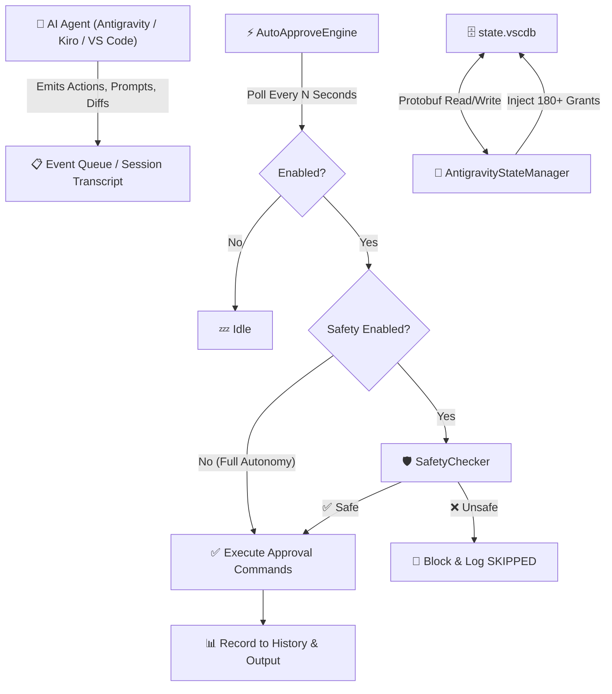

<div align="center">


# ⚡ AI IDE Auto-Approve Extension

### Eliminate Every Popup. Achieve Full AI Autonomy.

**The universal, ultra-fast, 100% native auto-approval engine for AI-powered IDEs.**<br/>
**Google Antigravity IDE · Kiro IDE · VS Code**

<br/>

[](https://github.com/MaheshTechnicals/AI-IDE-Auto-Approve-Extension/releases/latest)
[](LICENSE)
[](https://github.com/MaheshTechnicals/AI-IDE-Auto-Approve-Extension)

[](https://github.com/MaheshTechnicals/AI-IDE-Auto-Approve-Extension/releases/latest)
[](test/)
[](tsconfig.json)
[](package.json)
[](https://github.com/MaheshTechnicals/AI-IDE-Auto-Approve-Extension)

<br/>

<a href="https://www.paypal.com/paypalme/Varma161" target="_blank"></a>
<a href="https://www.paypal.com/paypalme/Varma161" target="_blank"></a>

</div>

<br/>

> [!IMPORTANT]
> This extension is **NOT available** on the VS Code Marketplace. It is distributed as a `.vsix` file via **[GitHub Releases](https://github.com/MaheshTechnicals/AI-IDE-Auto-Approve-Extension/releases/latest)**.<br/>
> **Good news:** It comes with a **Built-in Auto-Updater**! Once installed, it checks for future updates from GitHub Releases and updates itself with 1 click.

---

## 🎬 What Does It Do?

When you use AI agents inside **Google Antigravity IDE**, **Kiro IDE**, or **VS Code**, the agent constantly asks for your permission:

> *"Allow terminal command?"* · *"Accept file edit?"* · *"Run this tool?"* · *"Execute diff?"*

**AI IDE Auto-Approve eliminates ALL of these interruptions.** It runs a lightweight native polling engine that auto-approves every agent request in real-time — giving your AI full autonomy to code, build, test, and deploy without pause.

### 🧠 How It Works — Three Engines in One

| Engine | IDE | Mechanism |
|---|---|---|
| **Protobuf USS Injection** | Google Antigravity IDE | Injects 180+ command permissions directly into `state.vscdb` via wire-type aware Protobuf serialization |
| **Session Transcript Monitor** | Google Antigravity IDE | Reads `transcript.jsonl` in real-time to detect pending tool calls |
| **Native Command Dispatcher** | Kiro IDE / VS Code | Fires `kiroAgent.execution.runOrAcceptAll` and 11 Antigravity approval commands every poll cycle |

---

## ✨ Key Features

<table>
<tr>
<td width="60">⚡</td>
<td><strong>Native Antigravity USS Database Sync</strong><br/>Directly injects bit-exact Protobuf permissions into <code>state.vscdb</code> (<code>permission_grants_global</code>), solving the limitation where the native language server ignores <code>command(*)</code> wildcards.</td>
</tr>
<tr>
<td>🧰</td>
<td><strong>180+ Pre-Approved Developer Commands</strong><br/>Out-of-the-box autonomous execution across 12 categories — shells, runtimes, package managers, core utilities, compilers, containers, databases, and more.</td>
</tr>
<tr>
<td>🚫</td>
<td><strong>Zero Screen Automation / No OCR</strong><br/>100% native Extension Host APIs. No mouse simulation, no pixel scraping. Works reliably over VNC, SSH remote, WSL, and headless setups.</td>
</tr>
<tr>
<td>🔓</td>
<td><strong>Full Autonomy Mode</strong><br/>Auto-approves ALL agent tool calls, terminal commands, diff hunks, and popups immediately without any restrictions.</td>
</tr>
<tr>
<td>🛡️</td>
<td><strong>Optional Safety Denylist</strong><br/>Configurable regex patterns block dangerous operations like <code>rm -rf</code>, <code>sudo</code>, <code>mkfs</code>, <code>format</code>, <code>curl | sh</code>, <code>DROP TABLE</code>, and reverse shells.</td>
</tr>
<tr>
<td>🌍</td>
<td><strong>Cross-Platform</strong><br/>Verified on <strong>Windows</strong>, <strong>Linux</strong>, and <strong>macOS</strong> with 5-candidate intelligent path resolution including <code>XDG_CONFIG_HOME</code> and <code>~/Library/Application Support/</code>.</td>
</tr>
<tr>
<td>📊</td>
<td><strong>Live Status Bar</strong><br/>One-click toggle with live approved/blocked counters. Visual indicator: <code>⚡ Auto-Approve: ALL</code> or <code>▶ Auto-Approve: OFF</code>.</td>
</tr>
<tr>
<td>📜</td>
<td><strong>Audit History</strong><br/>In-memory activity log with interactive QuickPick review. Inspect decisions with timestamps, payloads, and copy-to-clipboard.</td>
</tr>
<tr>
<td>🔄</td>
<td><strong>Built-in GitHub Auto-Updater</strong><br/>No marketplace required. Periodically checks GitHub Releases in the background and prompts to update with 1 click right inside your IDE.</td>
</tr>
</table>

---

## 🧰 Supported Commands (180+)

<details>
<summary><strong>🐚 Shells & Script Interpreters</strong> — 6 commands</summary>

`bash` · `sh` · `zsh` · `dash` · `fish` · `ksh`
</details>

<details>
<summary><strong>📦 Node.js / JavaScript / TypeScript</strong> — 26 commands</summary>

`node` · `nodejs` · `npm` · `npx` · `pnpm` · `pnpx` · `yarn` · `bun` · `bunx` · `deno` · `tsc` · `ts-node` · `tsx` · `esbuild` · `vite` · `next` · `webpack` · `rollup` · `turbo` · `jest` · `vitest` · `mocha` · `eslint` · `prettier` · `corepack`
</details>

<details>
<summary><strong>🐍 Python Ecosystem</strong> — 24 commands</summary>

`python` · `python3` · `python3.10–3.13` · `py` · `pip` · `pip3` · `pipx` · `poetry` · `pipenv` · `conda` · `mamba` · `uv` · `pytest` · `black` · `ruff` · `flake8` · `mypy` · `pylint` · `isort` · `virtualenv` · `venv`
</details>

<details>
<summary><strong>🔧 Core Linux / Unix Utilities</strong> — 66 commands</summary>

`git` · `curl` · `wget` · `sed` · `awk` · `gawk` · `jq` · `yq` · `base64` · `strings` · `tar` · `gzip` · `gunzip` · `zip` · `unzip` · `bzip2` · `bunzip2` · `xz` · `unxz` · `7z` · `chmod` · `chown` · `chgrp` · `rm` · `mv` · `cp` · `mkdir` · `rmdir` · `touch` · `cat` · `ls` · `dir` · `head` · `tail` · `grep` · `egrep` · `fgrep` · `rg` · `ag` · `ack` · `find` · `which` · `whereis` · `diff` · `patch` · `sort` · `uniq` · `wc` · `tr` · `cut` · `tee` · `xargs` · `comm` · `join` · `paste` · `column` · `hexdump` · `od` · `xxd` · `readlink` · `realpath` · `basename` · `dirname` · `file` · `stat` · `pathchk`
</details>

<details>
<summary><strong>⚙️ Process & System Diagnostics</strong> — 38 commands</summary>

`ps` · `top` · `htop` · `kill` · `pkill` · `killall` · `sleep` · `wait` · `nohup` · `timeout` · `time` · `date` · `cal` · `uptime` · `env` · `printenv` · `export` · `unset` · `uname` · `hostname` · `whoami` · `id` · `pwd` · `cd` · `df` · `du` · `free` · `lsof` · `fuser` · `ulimit` · `sysctl` · `dmesg` · `journalctl` · `echo` · `printf` · `test` · `true` · `false`
</details>

<details>
<summary><strong>🏗️ Compilers, Build Systems & Languages</strong> — 38 commands</summary>

`gcc` · `g++` · `cc` · `c++` · `clang` · `clang++` · `make` · `cmake` · `ninja` · `cargo` · `rustc` · `rustup` · `go` · `gofmt` · `golangci-lint` · `java` · `javac` · `jar` · `gradle` · `./gradlew` · `mvn` · `./mvnw` · `kotlin` · `kotlinc` · `dotnet` · `php` · `ruby` · `gem` · `bundle` · `rake` · `swift` · `perl` · `lua` · `luajit` · `R` · `Rscript` · `zig`
</details>

<details>
<summary><strong>🌐 Network & Remote</strong> — 12 commands</summary>

`ssh` · `scp` · `rsync` · `netstat` · `ss` · `ping` · `traceroute` · `nslookup` · `dig` · `host` · `nc` · `ncat` · `socat`
</details>

<details>
<summary><strong>🐳 Containers, Cloud & DevOps</strong> — 16 commands</summary>

`docker` · `docker-compose` · `podman` · `kubectl` · `helm` · `minikube` · `kind` · `terraform` · `vagrant` · `aws` · `gcloud` · `az` · `gh` · `glab` · `git-lfs` · `svn`
</details>

<details>
<summary><strong>🗄️ Databases</strong> — 6 commands</summary>

`sqlite3` · `psql` · `mysql` · `redis-cli` · `mongosh` · `mongo`
</details>

<details>
<summary><strong>📱 Android & Mobile</strong> — 4 commands</summary>

`adb` · `emulator` · `fastboot` · `scrcpy`
</details>

<details>
<summary><strong>💻 IDE & AI Tools</strong> — 4 commands</summary>

`code` · `antigravity` · `agy` · `kiro`
</details>

---

## 📦 Installation

> [!NOTE]
> This extension is distributed via **GitHub Releases** as a `.vsix` file. Download and install manually.

### Step 1 — Download

📥 **[Download Latest Release (.vsix)](https://github.com/MaheshTechnicals/AI-IDE-Auto-Approve-Extension/releases/latest)**

Or via CLI:
```bash
gh release download --repo MaheshTechnicals/AI-IDE-Auto-Approve-Extension --pattern '*.vsix'
```

### Step 2 — Install

<table>
<tr>
<th>IDE</th>
<th>CLI Command</th>
<th>GUI Method</th>
</tr>
<tr>
<td><strong>Google Antigravity</strong></td>
<td><code>antigravity --install-extension ai-ide-auto-approve-1.2.0.vsix --force</code></td>
<td>Extensions sidebar → <code>...</code> → "Install from VSIX..."</td>
</tr>
<tr>
<td><strong>Kiro IDE</strong></td>
<td><code>kiro --install-extension ai-ide-auto-approve-1.2.0.vsix --force</code></td>
<td>Extensions (<code>Ctrl+Shift+X</code>) → <code>...</code> → "Install from VSIX..."</td>
</tr>
<tr>
<td><strong>VS Code</strong></td>
<td><code>code --install-extension ai-ide-auto-approve-1.2.0.vsix --force</code></td>
<td>Extensions (<code>Ctrl+Shift+X</code>) → <code>...</code> → "Install from VSIX..."</td>
</tr>
</table>

### Build from Source (Optional)

```bash
git clone https://github.com/MaheshTechnicals/AI-IDE-Auto-Approve-Extension.git
cd AI-IDE-Auto-Approve-Extension
npm install && npm run build
npx @vscode/vsce package --no-dependencies
```

---

## 🎯 Quick Start

| Step | Action | Result |
|---|---|---|
| **1** | Click status bar item (bottom-right) | `⚡ Auto-Approve: ALL` = Active · `▶ Auto-Approve: OFF` = Paused |
| **2** | `Ctrl+Shift+P` → `AI IDE Auto-Approve: Toggle Safety Checks On/Off` | Switch between Full Autonomy and Safety Denylist modes |
| **3** | `Ctrl+Shift+P` → `AI IDE Auto-Approve: Show Recent Activity` | Inspect recent approvals/blocks with timestamps |
| **4** | `Ctrl+Shift+P` → `AI IDE Auto-Approve: Show Logs` | Open dedicated Output channel for live logging |
| **5** | `Ctrl+Shift+P` → `AI IDE Auto-Approve: Check for Updates` | Check GitHub Releases for new updates & install |

---

## 🔄 Built-in GitHub Auto-Updater

Because this extension is distributed directly on GitHub instead of the closed VS Code Marketplace, it includes an **autonomous self-updating engine**:

- ⏰ **Silent Background Polling**: Automatically checks GitHub Releases 30 seconds after IDE launch, then every 4 hours. Never slows down editor startup.
- 🚀 **1-Click Interactive Update**: When a new version is released on GitHub, an interactive prompt lets you update immediately with progress reporting.
- ⚡ **Zero Marketplace Dependency**: Directly downloads the `.vsix` release asset and executes VS Code's internal `workbench.extensions.installExtension` command.
- 🔍 **Manual Check Anytime**: Press `Ctrl+Shift+P` → select `AI IDE Auto-Approve: Check for Updates`.
- 🎛️ **Fully Configurable**: Turn automatic checks on or off anytime via `"aiIdeAutoApprove.autoUpdateCheck"`.

---

## ⚙️ Configuration

Accessible via `Settings > Extensions > AI IDE Auto-Approve`:

| Setting | Type | Default | Description |
|---|---|---|---|
| `aiIdeAutoApprove.enabled` | `boolean` | `true` | Master switch for the auto-approval engine |
| `aiIdeAutoApprove.safetyEnabled` | `boolean` | `false` | `false` = Full Autonomy (approve everything) · `true` = run denylist checks |
| `aiIdeAutoApprove.pollIntervalSeconds` | `number` | `2` | Polling frequency in seconds (min: 1s) |
| `aiIdeAutoApprove.enableKiro` | `boolean` | `true` | Enable Kiro IDE monitoring |
| `aiIdeAutoApprove.enableAntigravity` | `boolean` | `true` | Enable Antigravity IDE monitoring |
| `aiIdeAutoApprove.antigravityApproveCommands` | `string[]` | *(11 commands)* | Commands to fire for Antigravity approval |
| `aiIdeAutoApprove.approveCommandId` | `string` | `kiroAgent.execution.runOrAcceptAll` | Kiro approval command |
| `aiIdeAutoApprove.bannedKeywords` | `string[]` | *(22 regex patterns)* | Denylist patterns when safety is ON |
| `aiIdeAutoApprove.maxHistoryEntries` | `number` | `200` | Max activity records in memory |
| `aiIdeAutoApprove.autoUpdateCheck` | `boolean` | `true` | Auto-check GitHub Releases for updates in background |

> Legacy `kiroAutoApprove.*` keys are fully supported for backward compatibility.

---

## ⌨️ Commands

| Command | Description |
|---|---|
| `AI IDE Auto-Approve: Toggle On/Off` | Start or pause the approval engine |
| `AI IDE Auto-Approve: Toggle Safety Checks On/Off` | Switch Full Autonomy ↔ Safety mode |
| `AI IDE Auto-Approve: Show Recent Activity` | Interactive QuickPick activity viewer |
| `AI IDE Auto-Approve: Clear History` | Reset the decision history log |
| `AI IDE Auto-Approve: Add Banned Keyword` | Add a custom regex pattern to the denylist |
| `AI IDE Auto-Approve: Discover Editor Commands` | Debug: enumerate all IDE commands |
| `AI IDE Auto-Approve: Show Logs` | Open the live Output channel |
| `AI IDE Auto-Approve: Check for Updates` | Check GitHub Releases for new versions & update |

---

## 🏗️ Architecture



---

## 🛡️ Safety Denylist

When safety mode is enabled, these patterns are **blocked**:

| Category | Blocked Patterns |
|---|---|
| 🗑️ Destructive File Ops | `rm -rf`, `rm --recursive --force` |
| 🔐 Privilege Escalation | `sudo` |
| 💽 Disk Formatting | `mkfs`, `dd if=`, `format C:` |
| ⚠️ System Control | `shutdown`, `reboot`, `passwd` |
| 🌐 Remote Code Exec | `curl \| sh`, `curl \| bash`, `wget \| sh` |
| 🔓 Unsafe Permissions | `chmod 777`, `chmod a+rwx` |
| 📤 Git Force Push | `git push --force` |
| 🗄️ Database Destruction | `DROP TABLE`, `DROP DATABASE`, `TRUNCATE` |
| 💿 Raw Disk Access | `/dev/sd[a-z]` |
| 🪟 Windows Registry | `regedit`, `reg delete` |
| 💀 PowerShell Danger | `Remove-Item -Recurse -Force`, `Set-ExecutionPolicy Bypass` |
| 🐚 Reverse Shells | `nc -e`, `/dev/tcp/` |
| 🗂️ Windows File Deletion | `del /s`, `del /q`, `del /f` |

> Add custom patterns via Command Palette → `AI IDE Auto-Approve: Add Banned Keyword`

---

## 🧪 Development

```bash
git clone https://github.com/MaheshTechnicals/AI-IDE-Auto-Approve-Extension.git
cd AI-IDE-Auto-Approve-Extension
npm install

npm test          # 80 unit tests
npm run lint      # TypeScript type check
npm run build     # Production bundle (esbuild)
npm run watch     # Dev mode with hot reload
```

Press **`F5`** in your IDE to launch the Extension Development Host with live debugging.

---

## 📋 Releases

| Version | Highlights |
|---|---|
| [**v1.2.0**](https://github.com/MaheshTechnicals/AI-IDE-Auto-Approve-Extension/releases/tag/v1.2.0) | ✨ Approval shine animation, offset-based file reading, activity counter bug fixes, 91 tests |
| [**v1.1.0**](https://github.com/MaheshTechnicals/AI-IDE-Auto-Approve-Extension/releases/tag/v1.1.0) | 🔄 Built-in auto-updater (GitHub Releases), manual update check, 91 tests |
| [**v1.0.0**](https://github.com/MaheshTechnicals/AI-IDE-Auto-Approve-Extension/releases/tag/v1.0.0) | 🚀 Major milestone: 180+ grants, native Protobuf USS injection, 80 tests |
| **v0.4.0** | 🔄 Rebrand to "AI IDE Auto-Approve", dual namespace support |
| **v0.3.0** | 🔗 Google Antigravity IDE integration, dual-engine architecture |
| **v0.2.x** | 📊 Decision counters, refined safety patterns, Full Autonomy mode |
| **v0.1.0** | 🎉 Initial release |

See full changelog → [CHANGELOG.md](CHANGELOG.md)

---

## 🤝 Contributing

Contributions are welcome! Here's how:

1. **Fork** the repository
2. **Create** your feature branch → `git checkout -b feature/awesome-feature`
3. **Commit** your changes → `git commit -m 'Add awesome feature'`
4. **Push** to the branch → `git push origin feature/awesome-feature`
5. **Open** a Pull Request

---

## 📄 License

This project is licensed under the [MIT License](LICENSE).

---

<div align="center">

## 💖 Support This Project

If this extension saves you time, please consider supporting it!

<br/>

<a href="https://github.com/MaheshTechnicals/AI-IDE-Auto-Approve-Extension">
  
</a>

<br/><br/>

<a href="https://www.paypal.com/paypalme/Varma161" target="_blank">
  
</a>

<br/><br/>

<a href="https://www.paypal.com/paypalme/Varma161" target="_blank">
  
</a>

<br/>

**PayPal:** [paypal.me/Varma161](https://www.paypal.com/paypalme/Varma161)

<br/>

> *Every ⭐ star, ☕ coffee, and 💰 donation keeps this project alive. Thank you!* 🙏

---

**Made with ❤️ by [MaheshTechnicals](https://github.com/MaheshTechnicals)**

[⬇️ Download](https://github.com/MaheshTechnicals/AI-IDE-Auto-Approve-Extension/releases/latest) · [🐛 Report Bug](https://github.com/MaheshTechnicals/AI-IDE-Auto-Approve-Extension/issues) · [✨ Request Feature](https://github.com/MaheshTechnicals/AI-IDE-Auto-Approve-Extension/issues) · [💖 Donate](https://www.paypal.com/paypalme/Varma161)

</div>
